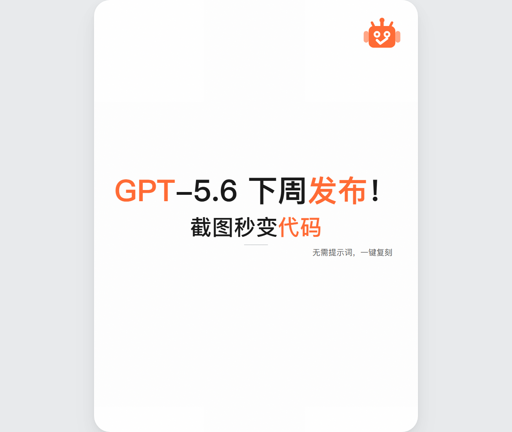

# 🤖 小红书极简扁平封面生成器 (xiaohongshu-minimal-cover)

自动生成符合「6/16 极简扁平封面规范」的小红书 3:4 竖版封面图。

## 效果预览

| 科技新品 | 行业新闻 | 教程技巧 |
|---------|---------|---------|
|  |  |  |
| 🤗 兴奋机器人 | 🤗 兴奋机器人 | 🤔 思考机器人 |

## 安装到 Codex

```bash
# 通过 CLI 安装（推荐）
npx skills add wuxinpro/xiaohongshu-minimal-cover

# 或手动克隆到 skills 目录
git clone https://github.com/wuxinpro/xiaohongshu-minimal-cover.git
```

安装后，在 Codex 中直接说"做一个小红书封面"或"生成极简封面"即可使用。

## 独立使用

```bash
# 完整标题（自动按标点拆行）
python scripts/generate_cover.py --title "GPT-5.6 下周发布！截图秒变代码"

# 手动指定两行 + 标语
python scripts/generate_cover.py --line1 "豆包 AI 能打车了！" --line2 "一句话叫车" --slogan "字节悄悄布局出行赛道"

# 仅指定标题，标语自动生成
python scripts/generate_cover.py --title "ChatGPT突然变快了？新功能实测太香了！"
```

生成后打开 `preview/*.html` 在浏览器中预览。

## 设计规范

- **比例**: 3:4 竖版（1080×1440），白色圆角卡片独立作为封面
- **标题**: 两行居中，#1a1a1a 深炭黑，**字号自适应**确保一行完整显示
- **关键词**: #FF6B35 橙色高亮（品牌词 + 业务词，每行 ≤ 2 个）
- **图标**: 右上角 100px 机器人 SVG（3 种表情按文案自动匹配）
- **标语**: 靠右对齐，#555 浅灰 20px

## 文件结构

```
xiaohongshu-minimal-cover/
├── SKILL.md          ← Codex 技能定义 + 完整设计规范
├── README.md         ← 本文件
├── images/           ← 效果截图
├── preview/          ← 生成的 HTML 预览
└── scripts/
    ├── cover_template.html  ← HTML 布局模板
    └── generate_cover.py    ← 核心生成器
```

## 机器人图标

| 风格 | 触发场景 |
|------|---------|
| 🤖 标准机器人 | 通用 AI 科技内容 |
| 🤗 兴奋机器人 | 新品发布/行业新闻/惊喜评测 |
| 🤔 思考机器人 | 教程技巧/代码分享 |

## 依赖

- Python 3.8+
- 无需额外依赖（纯标准库）
