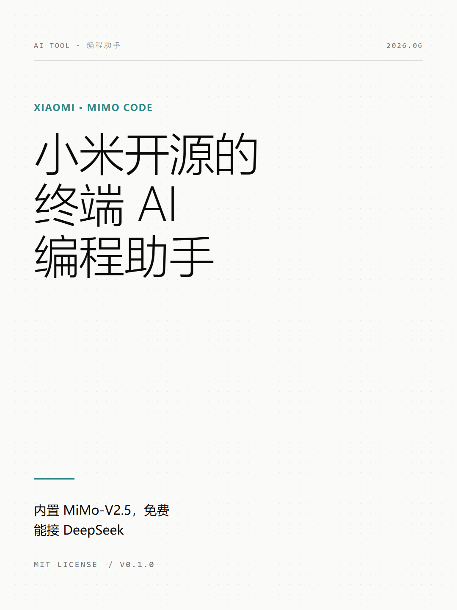
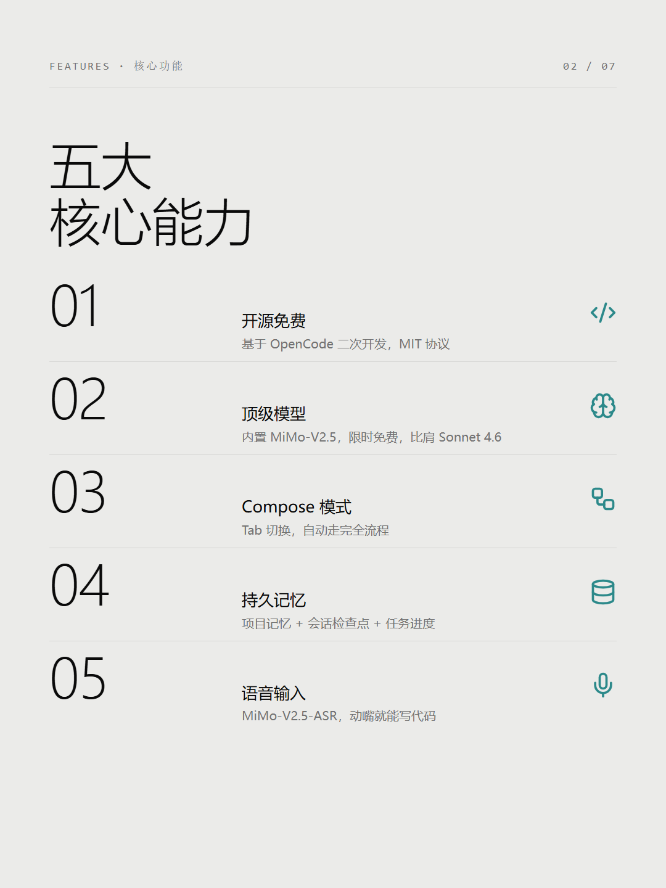
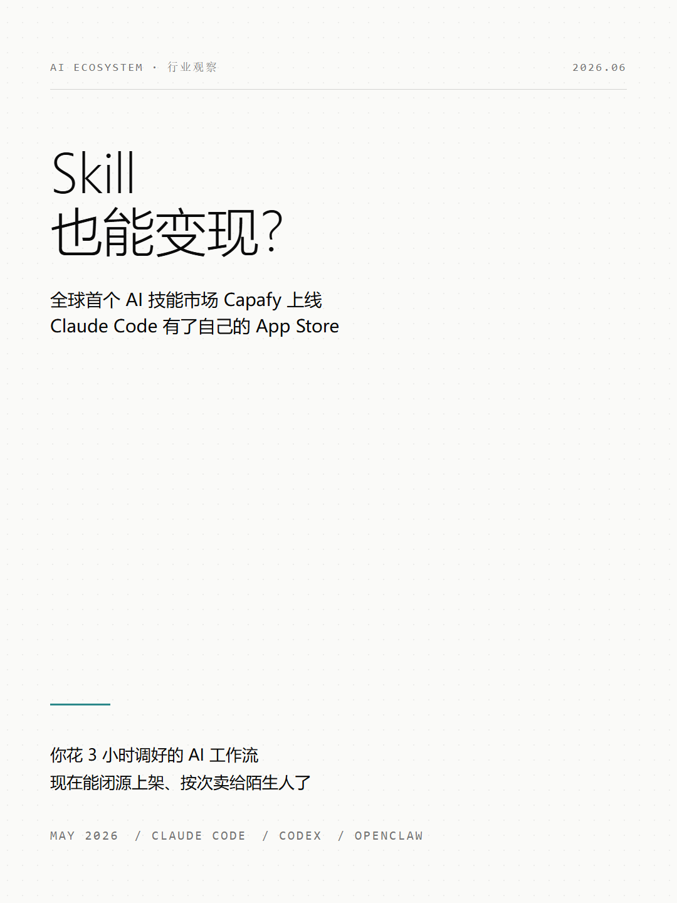
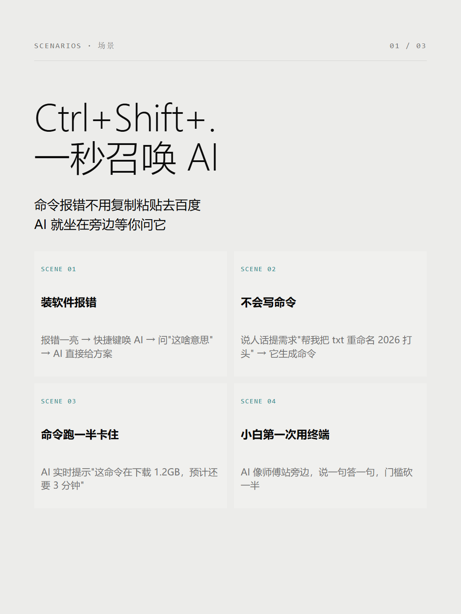

# Examples

All examples are 1080×1440 (3:4) Swiss International style, rendered with system fonts.

## MiMo Code · AI 编程工具发布

7 页产品发布卡组，Slate 配色 (#2c898a)。封面 + 功能列表 + Compose 模式 + 记忆系统 + 跑分对比 + 安装。

| Cover | Features |
|-------|----------|
|  |  |

## Capafy · AI 技能市场上线

4 页行业分析卡组，Slate 配色。封面 + 市场截图 + 3步流程 + 收入模式。

| Cover |
|-------|
|  |

## Win11 Intelligent Terminal · 微软 AI 终端

3 页产品配图，Slate 配色。4 个使用场景 + 关键三点 + 安装指令。

| Scenarios |
|-----------|
|  |

## AI 内容标注新规 · 政策解读

3 页政策分析卡组，Crimson 配色 (#c0392b)。封面 + 6类标签 + 创作者建议。

*Policy cards use crimson accent — the red signals urgency and regulation.*

---

## 配色速查

| Accent | 颜色 | 适用场景 |
|--------|------|---------|
| slate | `#2c898a` 青灰 | AI工具、开发者产品、B2B |
| crimson | `#c0392b` 暗红 | 政策法规、预警、待办 |
| ikb | `#002FA7` 克莱因蓝 | AI/科技通用 |
| lemon-green | `#C5E803` 柠檬绿 | 健康、环保、新科技 |
| safety-orange | `#FF6B35` 安全橙 | 工业、风险提醒 |
| wisteria | `#7d5ba6` 藤紫 | 创意、艺术、健康 |
